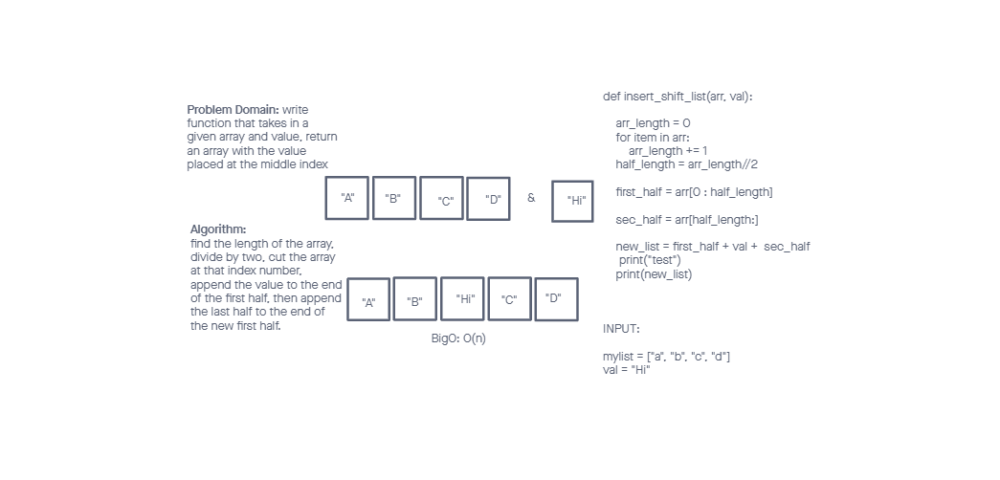

# Insert to Middle of an Array

<!-- Description of the challenge -->

Create a function that takes a given array and value and returns an array with the value in the middle index position.

## Whiteboard Process

<!-- Embedded whiteboard image -->

## Approach & Efficiency

<!-- What approach did you take? Discuss Why. What is the Big O space/time for this approach? -->

I counted the length of the array with a for loop, and divided the array length by two, rounded down, to find the length of the first half of the array. I sliced the array at that point, added the value to the end, and added the second half of the array to the end of the new first half.

Big O: O(n). As the array lengthens, the time to cycle through the function increases linearly.
