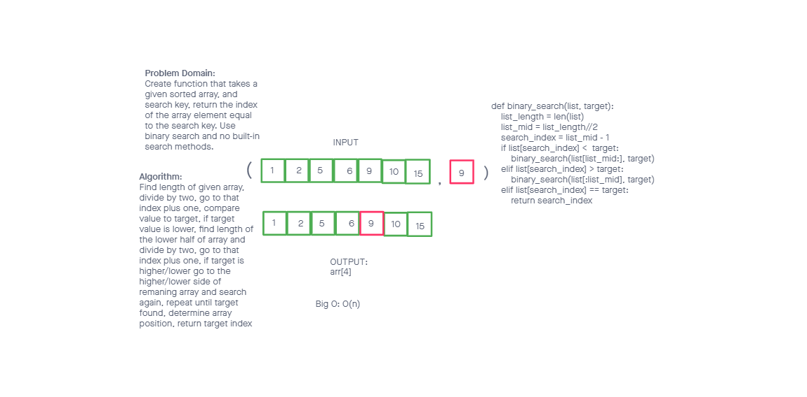

# Binary Search of Sorted Array

<!-- Description of the challenge -->

Create a function that takes a given array and target value, and returns the index position of the element in the array with the same value. Must use binary search and no built in methods.

## Whiteboard Process

<!-- Embedded whiteboard image -->

## Approach & Efficiency

<!-- What approach did you take? Discuss Why. What is the Big O space/time for this approach? -->

I used a recursive approach to tackle this problem. This makes the most sense because the same functionality is required after each iteration, so a function that calls itself until a result is reached fit the bill. BigO is O(n) due to linear expansion that correlates to the length of the array.
