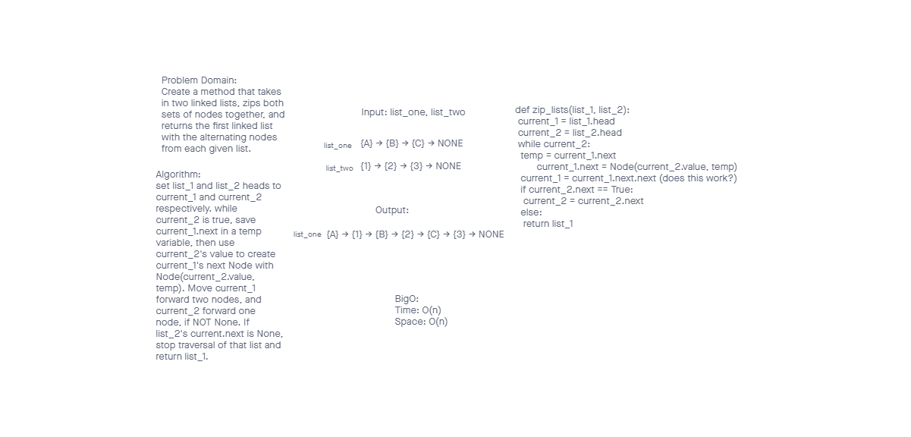

# Challenge Summary

Create a method that takes in two linked lists, and zips the nodes of each linked list together, returning the first list containing both sets of nodes.

## Whiteboard Process

## Approach & Efficiency

An iterative approach was used to increase readability and keep BigO time and space down to O(n).

## Solution

Please see the whiteboard image above and view the code [here](./linked_list_zip.py)
