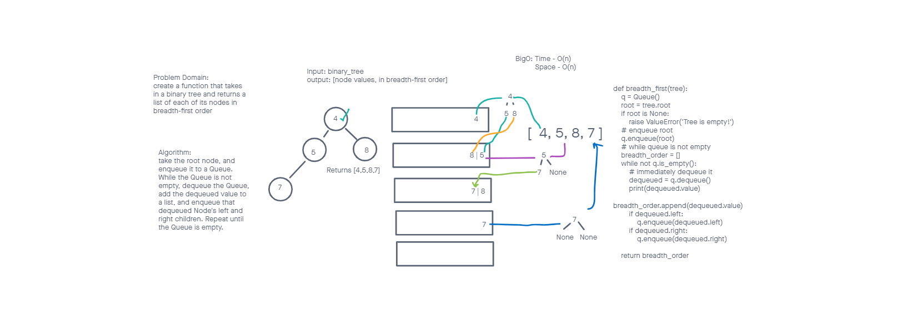

# Challenge Summary

Write a function that takes a given binary tree and returns a list containing each node's value in breadth-first order.

## Whiteboard Process

## Approach & Efficiency

The breadth_first() function uses a while loop to enqueue and dequeue each node. The queue that is holding the nodes may potentially enqueue at a rate that is twice that of the dequeue rate, therefore, the space requirement will continue to grow as long as there are two child nodes to enqueue.

-   Time - O(n)
-   Space - O(n)

## Solution

Please see the whiteboard above and or click [here](https://github.com/brannonstarnes/data-structures-and-algorithms/blob/main/python/code_challenges/tree_breadth_first/tree_breadth_first.py) to view the code.
