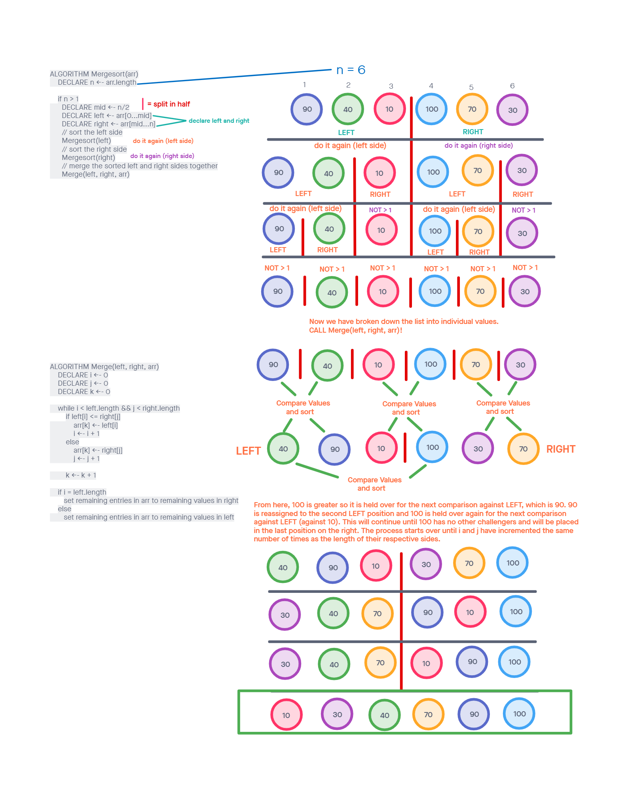

# Challenge Summary

<!-- Description of the challenge -->

Write blog material explaining how the Merge_sort algorithm works.

## Whiteboard Process

<!-- Embedded whiteboard image -->

## Approach & Efficiency

<!-- What approach did you take? Why? What is the Big O space/time for this approach? -->

This

## Solution

<!-- Show how to run your code, and examples of it in action -->

Please check out the image above for a step by step explanation.
