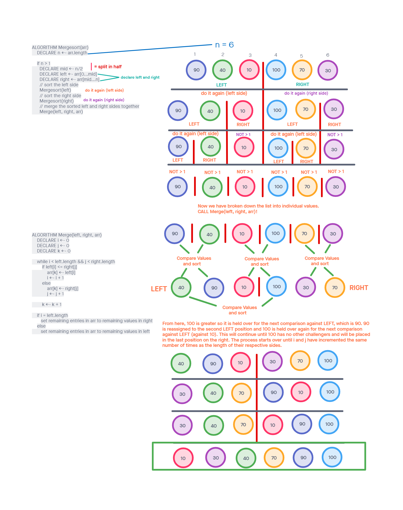

# A Pictorial Guide to MergeSort

###### Author: Brannon Starnes

Today we will be taking a look at one of the many sorting algorithms out there: MergeSort! This algorithm is characterized by a "divide and conquer" approach to sorting.

A list of integers is split at its midpoint into two teams, left and right. MergeSort is called again, recursively on each of these "teams". This will happen until the list is broken down to its smallest possible parts. Now, it's a matter of comparing 'team players' against one another. Whoever 'loses' is placed into the first available index position in a list. Once every iteration of comparison is completed, an ordered list emerges! Let's see it in action.

