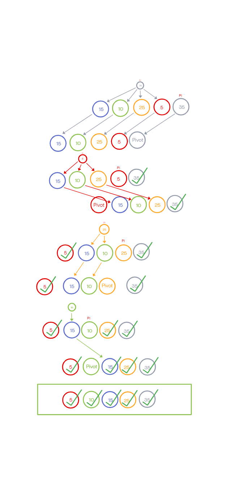

# Challenge Summary

<!-- Description of the challenge -->

Write blog material explaining how the quick_sort algorithm works.

## Whiteboard Process

<!-- Embedded whiteboard image -->

## Approach & Efficiency

<!-- What approach did you take? Why? What is the Big O space/time for this approach? -->

This approach is recursive and has a Big O for time of O(nlogn) and space order of O(1).

## Solution

<!-- Show how to run your code, and examples of it in action -->

Please check out the image above for a step by step explanation.
