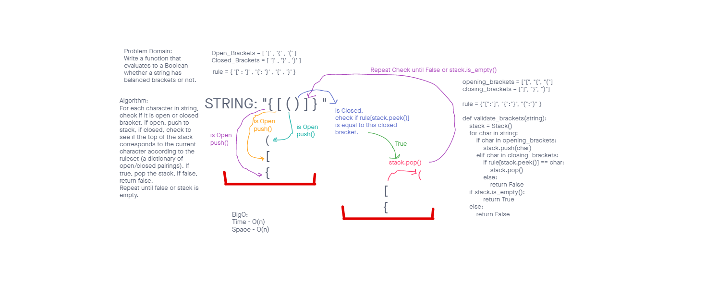

# Challenge Summary

Create a function that will evaluate to a boolean whether or not a string contains balanced brackets or not.

## Whiteboard Process

## Approach & Efficiency

I implemented a Stack to organize the individual characters, since a Last In First Out method was needed. My approach maintained a BigO of O(n) for both time and space.

## Solution

Please see the image above and view the code [here](https://github.com/brannonstarnes/data-structures-and-algorithms/blob/main/python/stack_queue_brackets/stack_queue_brackets.py).
